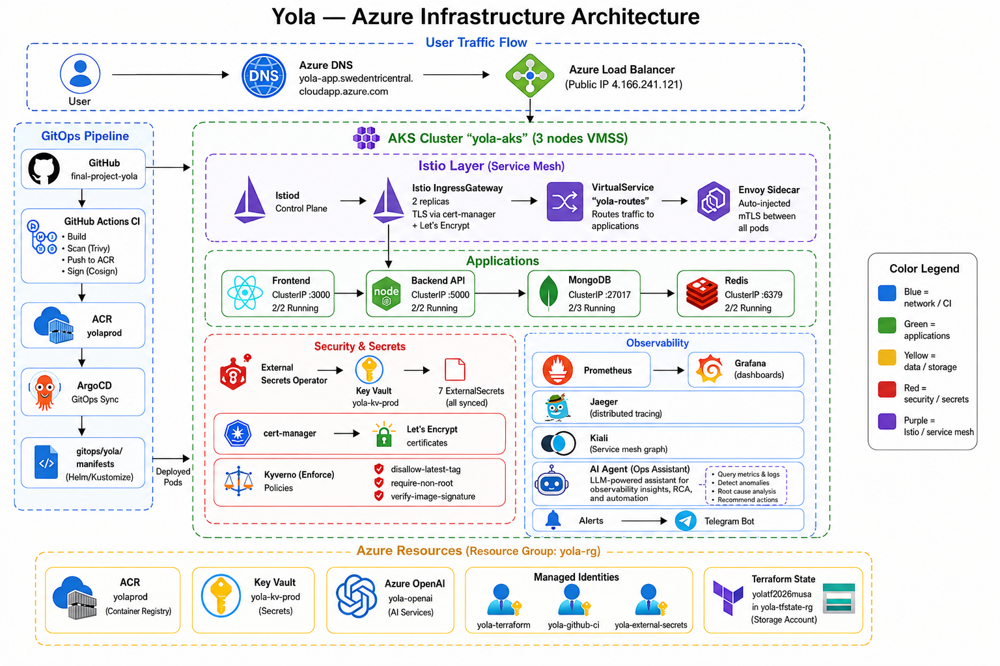

<div align="center">

# 🚗 Yola — Intercity Ride Sharing Platform

### Production-Grade DevOps Infrastructure on Azure

[](https://github.com/musaxasmammedov7/final-project-yola/actions/workflows/backend-ci.yml)
[](https://github.com/musaxasmammedov7/final-project-yola/actions/workflows/frontend-ci.yml)
[](https://github.com/musaxasmammedov7/final-project-yola/actions/workflows/terraform.yml)
[](https://opensource.org/licenses/MIT)

**Live:** [yola-app.swedentricentral.cloudapp.azure.com](https://yola-app.swedentricentral.cloudapp.azure.com)

</div>

---

## Executive Summary

Yola is a full-stack carpooling application for intercity travel across Azerbaijan, deployed on **Azure Kubernetes Service (AKS)** with enterprise-grade DevOps practices. The platform demonstrates a complete production pipeline — from Infrastructure as Code to GitOps deployment, from supply chain security to AI-powered observability.

> **Built by a team of 4** · **28 Azure resources** · **24 ArgoCD applications** · **6 CI/CD pipelines** · **7-layer security** · **12 architecture decisions documented**



---

## Table of Contents

- [Platform Features](#platform-features)
- [Architecture Overview](#architecture-overview)
- [Infrastructure](#infrastructure)
- [Security — Defense in Depth](#security--defense-in-depth)
- [CI/CD Pipelines](#cicd-pipelines)
- [Observability Stack](#observability-stack)
- [AI Agent](#ai-agent)
- [Tech Stack](#tech-stack)
- [Project Structure](#project-structure)
- [ADR — Architecture Decision Records](#adr--architecture-decision-records)
- [Evidence](#evidence)
- [Team](#team)
- [Getting Started](#getting-started)

---

## Platform Features

| Feature | Description |
|---------|-------------|
| **Ride Search** | Find available rides by route, date, and seat count |
| **Ride Offer** | Drivers publish routes with pricing and availability |
| **Real-time Tracking** | Live map view with ETA and status updates |
| **Smart Booking** | Seat selection with instant confirmation |
| **Chat Assistant** | AI-powered LLM chatbot for natural language ride queries |
| **Driver Profiles** | Ratings, trip history, and saved vehicles |
| **Cost Splitting** | Per-seat pricing for affordable intercity travel |

---

## Architecture Overview

```
                          ┌─────────────┐
                          │    User      │
                          │  (Browser)   │
                          └──────┬───────┘
                                 │
                    ┌────────────▼────────────┐
                    │     Azure DNS            │
                    │  yola-app.swedencentral  │
                    │  .cloudapp.azure.com     │
                    └────────────┬─────────────┘
                                 │
                    ┌────────────▼────────────┐
                    │   Azure Load Balancer    │
                    │   Public: 4.166.241.121  │
                    └────────────┬─────────────┘
                                 │
              ┌──────────────────▼──────────────────┐
              │         AKS Cluster (yola-aks)       │
              │                                      │
              │  ┌────────────────────────────────┐  │
              │  │     Istio IngressGateway        │  │
              │  │     TLS (Let's Encrypt)         │  │
              │  └──────────────┬─────────────────┘  │
              │                 │                     │
              │       ┌─────────┴─────────┐          │
              │       ▼                   ▼          │
              │  ┌──────────┐       ┌──────────┐    │
              │  │ Frontend │       │ Backend  │    │
              │  │ Next.js  │──────▶│ Node.js  │    │
              │  │  :3000   │       │  :5000   │    │
              │  └──────────┘       └────┬─────┘    │
              │                          │          │
              │            ┌─────────────┼─────┐    │
              │            ▼                   ▼    │
              │      ┌──────────┐       ┌────────┐ │
              │      │ MongoDB  │       │ Redis  │ │
              │      │  :27017  │       │ :6379  │ │
              │      └──────────┘       └────────┘ │
              └──────────────────────────────────────┘
```

**Detailed diagrams:** See [docs/Architecture-diagram.png](docs/Architecture-diagram.png)

---

## Infrastructure

### Azure Resources (28 managed by Terraform)

| Resource | Name | Purpose |
|----------|------|---------|
| **AKS Cluster** | `yola-aks` | Kubernetes (3-node VMSS, Standard_D2s_v3) |
| **ACR** | `yolaprod` | Container image registry (Basic tier) |
| **Key Vault** | `yola-kv-prod` | Secrets management (RBAC-enabled) |
| **Azure OpenAI** | `yola-openai` | GPT model for AI agent |
| **3 Managed Identities** | — | `yola-terraform`, `yola-github-ci`, `yola-external-secrets` |
| **User Assigned Identities** | — | OIDC federation for GitHub Actions |

### Terraform State

| Property | Value |
|----------|-------|
| **State Account** | `yolatf2026musa` |
| **Resource Group** | `yola-tfstate-rg` |
| **Backend** | Azure Blob Storage |
| **Encryption** | Server-side encryption enabled |
| **Versioning** | State versioning enabled |

### Provisioning Flow

```
terraform validate → terraform plan → PR comment → manual approve → terraform apply
```

---

## Security — Defense in Depth

Seven layers of security, each independently verifiable:

```
┌─────────────────────────────────────────────────────┐
│  Layer 7: Runtime          │ Falco syscall monitor  │
├─────────────────────────────────────────────────────┤
│  Layer 6: Pod Security     │ PSS restricted profiles│
├─────────────────────────────────────────────────────┤
│  Layer 5: Container        │ Non-root, RO fs, drops │
├─────────────────────────────────────────────────────┤
│  Layer 4: Admission Control│ Kyverno Enforce (3)    │
├─────────────────────────────────────────────────────┤
│  Layer 3: Network          │ 14 NetPol + Istio mTLS │
├─────────────────────────────────────────────────────┤
│  Layer 2: Supply Chain     │ Trivy + Snyk + Cosign  │
├─────────────────────────────────────────────────────┤
│  Layer 1: Secrets          │ Key Vault → ESO → K8s  │
└─────────────────────────────────────────────────────┘
```

### Kyverno Policies (Enforce Mode)

| Policy | Effect |
|--------|--------|
| `disallow-latest-tag` | Blocks images with `:latest` tag |
| `require-non-root` | Enforces `runAsNonRoot: true` |
| `verify-image-signature` | Cosign keyless verification against Rekor |

### Supply Chain Security

```
Code Push → SonarCloud (SAST) → Snyk (SCA) → Trivy (CVE scan)
    → Cosign sign (keyless) → Push to ACR → Kyverno verify → Deploy
```

---

## CI/CD Pipelines

### 6 GitHub Actions Workflows

| Pipeline | Trigger | Steps |
|----------|---------|-------|
| **Backend CI** | `push` to `backend/` | Lint → Test → SonarCloud → Snyk → Build → Trivy → Push → Cosign → GitOps |
| **Frontend CI** | `push` to `frontend/` | Lint → TypeCheck → SonarCloud → Snyk → Build → Trivy → Push → Cosign → GitOps |
| **Terraform** | `push` to `terraform/` | Validate → Plan → PR Comment → Apply (with approval) |
| **Identity Bootstrap** | Manual | Azure AD app registration + OIDC federation |
| **ArgoCD Bootstrap** | Manual | Helm install + cluster secret |
| **Drift Detection** | Weekly | Terraform plan → auto-issue on drift |

### Pipeline Architecture

```
┌──────────┐    ┌──────────┐    ┌──────────┐    ┌──────────┐
│  GitHub   │───▶│  CI/CD   │───▶│   ACR    │───▶│ ArgoCD   │
│  Actions  │    │ Pipeline │    │ Registry │    │  GitOps  │
└──────────┘    └──────────┘    └──────────┘    └──────────┘
                     │                               │
              ┌──────┴──────┐                ┌───────▼──────┐
              │ SonarCloud  │                │    AKS       │
              │ Snyk        │                │  (Autosync)  │
              │ Trivy       │                └──────────────┘
              │ Cosign      │
              └─────────────┘
```

### PR Guards

- **Backend CI:** Only runs on changes to `backend/`
- **Frontend CI:** Only runs on changes to `frontend/`
- **Terraform:** Requires `production` GitHub Environment with required reviewers
- **Image signing:** Cosign keyless (Fulcio + Rekor transparency log)

---

## Observability Stack

### Three Pillars + AI Analysis

| Pillar | Tool | Deployment | Purpose |
|--------|------|------------|---------|
| **Metrics** | Prometheus | Helm (kube-prometheus-stack) | Time-series metrics collection |
| **Visualization** | Grafana | Helm | 8+ dashboards (K8s, Istio, Redis, Node) |
| **Logs** | Loki + Promtail | Helm | Log aggregation and querying |
| **Traces** | Jaeger | Helm | Distributed tracing (100% sampling) |
| **Service Graph** | Kiali | Helm | Istio mesh visualization |
| **Runtime Security** | Falco | Helm | Syscall monitoring + alerting |
| **AI Analysis** | Python CronJob | Custom | GPT-powered analysis every 6h |

### Dashboards

- Kubernetes API Server
- Istio Control Plane
- Node Exporter (system metrics)
- Redis Performance
- MongoDB Metrics
- Custom application metrics

### Alert Rules (14 active)

| Category | Examples |
|----------|----------|
| **Infrastructure** | NodeNotReady, HighCPU, DiskPressure |
| **Application** | HighErrorRate, HighLatency, PodCrashLooping |
| **Security** | FalcoSuspiciousActivity, UnauthorizedAccess |
| **AI Agent** | Automated 6h analysis → Telegram bot |

---

## AI Agent

### Automated Infrastructure Health Monitoring

```
┌─────────────┐    ┌─────────────┐    ┌──────────────┐    ┌──────────┐
│  Prometheus  │───▶│   Python    │───▶│  Azure OpenAI│───▶│ Telegram │
│  Loki        │───▶│  CronJob    │    │  GPT model   │    │   Bot    │
│  Jaeger      │───▶│  analyze.py │    │              │    │          │
│  K8s API     │───▶│             │    └──────────────┘    └──────────┘
└─────────────┘    └─────────────┘
```

**Schedule:** Every 6 hours (CronJob)

**Data collected:**
- Cluster health (node status, pod counts, resource usage)
- Application health (deployment status, restart counts, error rates)
- Service mesh (Istio metrics, latency, error rates)
- Recent alerts and incidents

**Output:** Structured Telegram message with:
- Overall health score (Healthy / Warning / Critical)
- Per-component status
- Trends and predictions
- Recommended actions

---

## Tech Stack

| Category | Technologies |
|----------|-------------|
| **Cloud Platform** | Microsoft Azure (SwedCentral) |
| **Container Orchestration** | AKS (Kubernetes 1.29+) |
| **Service Mesh** | Istio 1.20+ |
| **GitOps** | ArgoCD |
| **Infrastructure as Code** | Terraform (Azure Provider) |
| **CI/CD** | GitHub Actions + OIDC |
| **Frontend** | Next.js 15, React 19, TypeScript, Tailwind CSS |
| **Backend** | Node.js, Express, TypeScript |
| **Database** | MongoDB (Community Operator), Redis |
| **Container Registry** | Azure Container Registry |
| **Secrets Management** | Azure Key Vault + External Secrets Operator |
| **Security Scanning** | SonarCloud, Snyk, Trivy, Kyverno |
| **Image Signing** | Sigstore Cosign (keyless) |
| **Runtime Security** | Falco |
| **Monitoring** | Prometheus, Grafana, Loki, Jaeger, Kiali |
| **AI/ML** | Azure OpenAI (GPT model) |
| **Notifications** | Telegram Bot API, Email (SMTP) |

---

## Project Structure

```
final-project-yola/
├── terraform/                     # Infrastructure as Code
│   ├── bootstrap/                 # Azure AD identities + OIDC federation
│   ├── main.tf                    # AKS, ACR, Key Vault, OpenAI, IPs
│   ├── secrets.tf                 # Key Vault secrets
│   ├── outputs.tf                 # Cluster endpoint, IDs
│   └── variables.tf               # Input variables
│
├── gitops/                        # Kubernetes manifests (24 ArgoCD apps)
│   ├── apps/                      # ArgoCD Application definitions
│   ├── yola/                      # Application workloads
│   │   ├── frontend/              # Deployment + ConfigMap
│   │   ├── backend/               # Deployment + ConfigMap + PDB + HPA
│   │   ├── mongodb/               # StatefulSet + PersistentVolume
│   │   └── redis/                 # StatefulSet + PersistentVolume
│   ├── istio/                     # Gateway + VirtualService + Certificate
│   ├── observability/             # Prometheus + Grafana + Loki + Jaeger
│   ├── kyverno/                   # ClusterPolicies (Enforce)
│   ├── ai-agent/                  # CronJob + Python script
│   └── external-secrets/          # SecretStore + ExternalSecrets
│
├── frontend/                      # Next.js frontend source
│   ├── app/                       # Pages (15 routes)
│   ├── components/                # UI components (ChatBot, PinPicker, etc.)
│   ├── lib/                       # API client, data utilities
│   ├── context/                   # Auth context
│   └── Dockerfile                 # Multi-stage build
│
├── backend/                       # Express backend source
│   ├── src/                       # Routes, controllers, models, services
│   ├── test/                      # Unit tests
│   └── Dockerfile                 # Multi-stage build
│
├── .github/workflows/             # 6 CI/CD pipelines
│   ├── backend-ci.yml
│   ├── frontend-ci.yml
│   ├── terraform.yml
│   ├── identity-bootstrap.yml
│   ├── argocd-bootstrap.yml
│   └── drift-detection.yml
│
├── docs/
│   ├── Architecture-diagram.png   # Azure infrastructure diagram
│   ├── adr/                       # 12 Architecture Decision Records
│   └── evidence/                  # Screenshots (ArgoCD, Grafana, Jaeger, Kiali)
│
└── load-test/                     # k6 load testing scripts
```

---

## ADR — Architecture Decision Records

| # | Decision | Alternatives Considered | Rationale |
|---|----------|------------------------|-----------|
| 1 | **AKS** over EKS/GKE | Lower latency to Azerbaijan, EU data residency, student subscription credits |
| 2 | **Istio** over Linkerd | Richer ecosystem (Kiali, traffic policies), wider community |
| 3 | **ArgoCD** over Flux | Superior UI, multi-cluster support, easier onboarding |
| 4 | **Kyverno** over OPA Gatekeeper | Kubernetes-native YAML, no Rego learning curve |
| 5 | **MongoDB Community Operator** | Free, native K8s integration, no license overhead |
| 6 | **Azure OpenAI** | Low-latency inference, EU data residency (SwedCentral) |
| 7 | **Cosign keyless** over key-based | No key management burden, OIDC-based verification |
| 8 | **Prometheus + Loki + Jaeger** | Full observability: metrics + logs + traces, all CNCF |
| 9 | **Terraform** over Pulumi | Declarative HCL, mature Azure provider, state simplicity |
| 10 | **NetworkPolicy + mTLS** | Defense-in-depth: pod-level + mesh-level encryption |
| 11 | **CronJob AI Agent** over DaemonSet | Cost-efficient, no dedicated node, runs on schedule |
| 12 | **External Secrets Operator** | Centralized secret management, auto-rotation capable |

Full ADRs: [docs/adr/](docs/adr/)

---

## Evidence

| Component | Screenshot |
|-----------|-----------|
| **ArgoCD** — All apps Synced & Healthy | [View](docs/evidence/argocd/argocd-apps-synced.png) |
| **Prometheus & Grafana** — 8 dashboards | [View](docs/evidence/Prometheus%20%26%20Grafana/) |
| **Jaeger** — Distributed traces | [View](docs/evidence/jaeger/) |
| **Kiali** — Service mesh graph | [View](docs/evidence/kiali/) |
| **Architecture Diagram** | [View](docs/Architecture-diagram.png) |

---

## Team

| Member | Role | Key Contributions |
|--------|------|-------------------|
| **Musa** | Infrastructure Lead | Terraform, ArgoCD, Kubernetes, Security policies, AI Agent, Kyverno |
| **Aga** | Full-Stack Developer | Next.js frontend, Node.js backend, MongoDB integration, ChatBot |
| **Ismayil** | Observability Engineer | Prometheus, Grafana, Loki, Jaeger, Kiali, Alert rules |
| **Farhad** | CI/CD Engineer | GitHub Actions, Docker, Cosign signing, Trivy scanning |

---

## Getting Started

### Prerequisites

- Azure CLI (`az login`)
- kubectl
- Docker
- Terraform 1.5+
- Node.js 20+

### Access Services

```bash
# Grafana (dashboards)
kubectl port-forward svc/prometheus-grafana -n monitoring 3000:80

# Prometheus (metrics)
kubectl port-forward svc/prometheus-grafana-kube-pr-prometheus -n monitoring 9090:9090

# ArgoCD (GitOps UI)
kubectl port-forward svc/argocd-server -n argocd 8443:443

# Kiali (service mesh)
kubectl port-forward svc/kiali -n istio-system 20001:20001

# Jaeger (distributed tracing)
kubectl port-forward svc/jaeger-query -n monitoring 16686:16686
```

| Service | Local URL | Production URL |
|---------|-----------|----------------|
| **Yola App** | — | [yola-app.swedentricentral.cloudapp.azure.com](https://yola-app.swedentricentral.cloudapp.azure.com) |
| **Grafana** | http://localhost:3000 | — |
| **Prometheus** | http://localhost:9090 | — |
| **ArgoCD** | https://localhost:8443 | — |
| **Kiali** | http://localhost:20001 | — |
| **Jaeger** | http://localhost:16686 | — |

---

<div align="center">

**Built with passion in Baku, Azerbaijan** 🇦🇿

*Enterprise DevOps practices applied to a student project*

</div>
