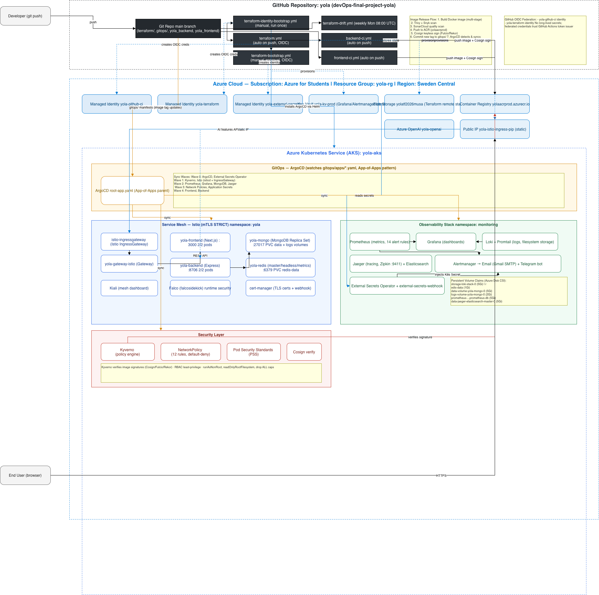

# Yola — Intercity Ride Sharing Platform

A full-stack carpooling web application deployed on **Azure Kubernetes Service** with enterprise-grade DevOps, security, and observability.



---

## What is Yola?

Yola is a web application for finding and sharing rides between Azerbaijan cities. Built with **Next.js** (frontend) and **Node.js/Express** (backend), it runs on a production-grade Kubernetes cluster with automated CI/CD, security policies, and AI-powered monitoring.

**Key features:**
- Offer and search rides between cities
- Save favorite cars and set preferred routes
- Split costs between passengers
- Real-time ride tracking with maps
- RESTful API with MongoDB backend
- Redis caching for performance

---

## Architecture

```
                                    User
                                      │
                                ┌─────▼─────┐
                                │   Istio    │
                                │  Gateway   │  ← TLS termination + routing
                                └─────┬─────┘
                              ┌───────┴───────┐
                              ▼               ▼
                        ┌──────────┐   ┌──────────┐
                        │ Frontend │   │ Backend  │
                        │ Next.js  │   │ Node.js  │
                        │   :3000  │──▶│  :8706   │
                        └──────────┘   └────┬─────┘
                                            │
                              ┌─────────────┼─────────────┐
                              ▼                           ▼
                        ┌──────────┐                ┌──────────┐
                        │ MongoDB  │                │  Redis   │
                        │  :27017  │                │  :6379   │
                        └──────────┘                └──────────┘
```

### AI Agent

```
  Prometheus ─┐
  Loki ───────┼──▶ Python ──▶ GPT-5-nano ──▶ Telegram
  Jaeger ─────┤    analyze.py                 Bot Report
  K8s API ────┘    (CronJob)
```

**CronJob** every 6h collects metrics, sends to Azure OpenAI GPT-5-nano, posts health report to Telegram with trends/predictions/actions.

**Infrastructure:** Azure Kubernetes Service (AKS) with Istio service mesh, ArgoCD GitOps, and 7-layer security.

---

## Security

Seven layers of defense-in-depth:

| Layer | What | How |
|-------|------|-----|
| **Secrets** | Passwords in vault, not in code | Azure Key Vault → ExternalSecret → K8s Secret |
| **Supply Chain** | Every image signed and scanned | Trivy + Snyk + Cosign (keyless) |
| **Network** | Default-deny, encrypted mesh | 14 NetworkPolicy rules + Istio mTLS |
| **Admission** | Bad pods blocked before creation | Kyverno Enforce (3 policies) |
| **Container** | Minimal permissions inside | Non-root, read-only filesystem, no caps |
| **PSS** | Security rules per namespace | restricted for app, privileged for infra |
| **Runtime** | Real-time syscall monitoring | Falco → Email + Telegram alerts |

---

## CI/CD

Six GitHub Actions pipelines:

| Pipeline | Trigger | What it does |
|----------|---------|-------------|
| **Backend CI** | Push to backend code | Scan → Test → Build → Sign → Push → Deploy |
| **Frontend CI** | Push to frontend code | Scan → Test → Build → Sign → Push → Deploy |
| **Terraform** | Push to infrastructure code | Validate → Plan → Comment → Apply |
| **Identity Bootstrap** | Manual (once) | Create Azure identities + OIDC |
| **ArgoCD Bootstrap** | Manual (once) | Install GitOps controller |
| **Drift Detection** | Weekly (Monday) | Check state → auto-issue if drift |

**Flow:** Code → SonarCloud → Snyk → Trivy → Cosign → ACR → ArgoCD → AKS

---

## Observability

Three pillars of observability + AI analysis:

| Pillar | Tool | What it does |
|--------|------|-------------|
| **Metrics** | Prometheus + Grafana | CPU, RAM, request rates, error rates (8 dashboards) |
| **Logs** | Loki + Promtail | Log aggregation from all pods |
| **Traces** | Jaeger | Distributed tracing (100% sampling) |
| **Runtime** | Falco | Syscall monitoring, suspicious activity alerts |
| **AI Agent** | GPT-5-nano | Automated analysis every 6 hours → Telegram |

**14 alert rules** → Email + Telegram notifications.

---

## Infrastructure

Managed with Terraform (28 resources):

| Resource | Purpose |
|----------|---------|
| AKS Cluster | Kubernetes (autoscaling 1-2 nodes) |
| ACR | Container image storage |
| Key Vault | Secrets management |
| Azure OpenAI | GPT-5-nano for AI agent |
| Public IP | Static IP for Istio ingress |
| 3 Identities | CI/CD + ESO authentication (OIDC) |

**Remote state:** Azure Blob Storage (encrypted, versioned)

---

## Project Structure

```
├── terraform/                 # Infrastructure as Code
│   ├── bootstrap/             # Identity + federation (run once)
│   ├── main.tf                # AKS, ACR, Key Vault, OpenAI
│   ├── secrets.tf             # Key Vault secrets
│   └── variables.tf           # Input variables
│
├── gitops/                    # Kubernetes manifests
│   ├── apps/                  # ArgoCD Applications (24 total)
│   ├── yola/                 # App workloads (backend, frontend, mongo, redis)
│   ├── istio/                 # Service mesh config
│   ├── observability/         # Prometheus, Grafana, Loki, Jaeger
│   ├── ai-agent/              # AI monitoring agent
│   └── kyverno/               # Security policies
│
├── .github/workflows/         # 6 CI/CD pipelines
├── expensy_backend/           # Backend source (Node.js/Express)
├── expensy_frontend/          # Frontend source (Next.js)
├── load-test/                 # k6 load testing
└── docs/                      # Documentation + ADRs
```

---

## Quick Start

### Prerequisites

- Azure subscription
- Azure CLI (`az login`)
- kubectl
- Docker

### Access via Localhost

```bash
# Start port-forward (run in separate terminals)

# Grafana — dashboards
kubectl port-forward svc/prometheus-grafana -n monitoring 3000:80

# Prometheus — metrics
kubectl port-forward svc/prometheus-grafana-kube-pr-prometheus -n monitoring 9090:9090

# ArgoCD — GitOps UI
kubectl port-forward svc/argocd-server -n argocd 8080:443

# Kiali — service mesh
kubectl port-forward svc/kiali -n istio-system 20001:20001

# Jaeger — distributed tracing
kubectl port-forward svc/jaeger-query -n monitoring 16686:16686

# Loki — log queries (via Grafana)
# Already included in Grafana dashboards
```

| Service | URL |
|---------|-----|
| **Grafana** | http://localhost:3000 |
| **Prometheus** | http://localhost:9090 |
| **ArgoCD** | https://localhost:8443 |
| **Kiali** | http://localhost:20001 |
| **Jaeger** | http://localhost:16686 |
| **Frontend** | https://yola-app.swedencentral.cloudapp.azure.com |

---

## Tech Stack

| Category | Tools |
|----------|-------|
| **Cloud** | Azure (AKS, ACR, Key Vault, OpenAI) |
| **Container** | Docker, Kubernetes, Istio |
| **GitOps** | ArgoCD, Kustomize, Helm |
| **Security** | Kyverno, Cosign, Trivy, Snyk, SonarCloud, Falco |
| **Monitoring** | Prometheus, Grafana, Loki, Jaeger, Kiali |
| **IaC** | Terraform, Azure Provider |
| **CI/CD** | GitHub Actions, OIDC federation |
| **Database** | MongoDB (Community Operator), Redis |
| **AI** | Azure OpenAI GPT-5-nano |

---

## Team

| Member | Role |
|--------|------|
| **Musa** | Infrastructure, Terraform, ArgoCD, Kubernetes, Security, AI Agent |
| **Aga** | Frontend (Next.js), Backend (Node.js/Express), MongoDB |
| **Ismayil** | Observability (Prometheus, Grafana, Loki, Jaeger) |
| **Farhad** | CI/CD Pipelines (GitHub Actions, Docker, Cosign) |

---

## ADR — Architecture Decision Records

| # | Decision | Rationale |
|---|----------|-----------|
| **1** | AKS over ECS/GKE | Students subscription, region (SwedCentral), integrated ecosystem |
| **2** | Istio over Linkerd | Richer feature set (Kiali, traffic policies), wider community support |
| **3** | ArgoCD over Flux | UI-driven GitOps, better multi-cluster support, easier onboarding |
| **4** | Kyverno over OPA Gatekeeper | Kubernetes-native YAML policies, no Rego learning curve |
| **5** | MongoDB Community Operator | Free, native K8s integration, no license overhead |
| **6** | Azure OpenAI GPT-5-nano | Low-latency inference, EU data residency (SwedCentral), pay-per-use |
| **7** | Cosign keyless signing | No key management burden, OIDC-based identity verification |
| **8** | Prometheus + Loki + Jaeger | Full observability stack: metrics + logs + traces, all CNCF projects |
| **9** | Terraform over Pulumi | Declarative HCL, mature Azure provider, state management simplicity |
| **10** | NetworkPolicy + Istio mTLS | Defense-in-depth: pod-level policies + mesh-level encryption |
| **11** | CronJob AI Agent over DaemonSet | No dedicated node needed, runs on schedule, cost-efficient |
| **12** | External Secrets Operator | Centralized secret management via Key Vault, auto-rotation capable |

Full ADRs in [docs/](docs/) directory.
